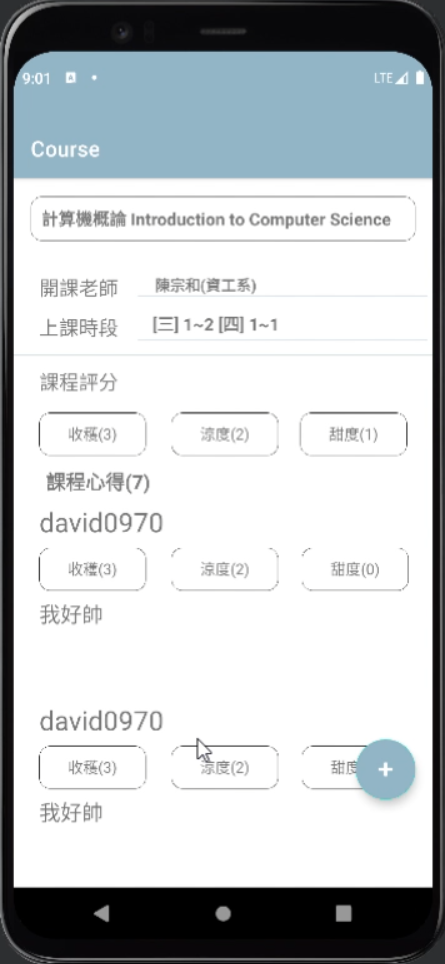
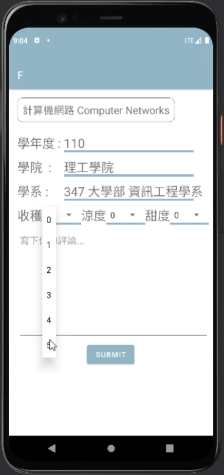
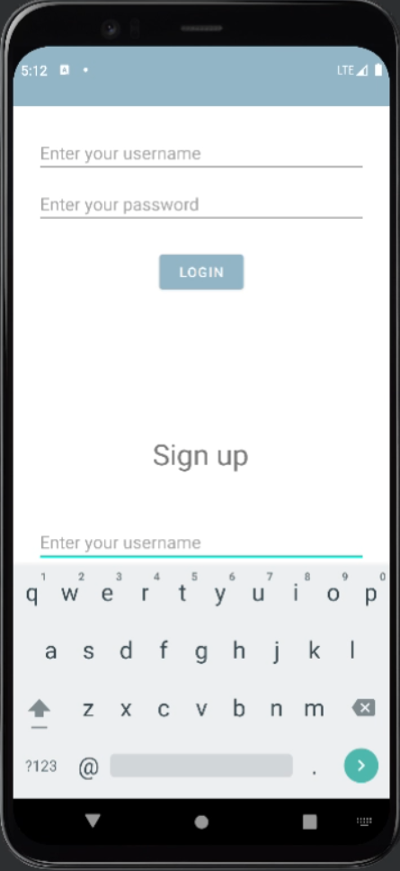
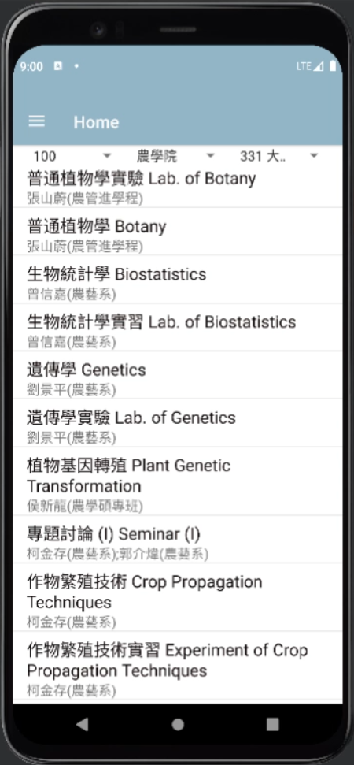

# 選課情報站

## 簡介
選課情報站是一個以行動裝置為基礎的專案，想為學生提供方便的選課資訊分享與課程評價平台。本專案結合本地伺服器、遠端伺服器與行動應用程式。

## 功能
1. **首頁**：  
   - 利用 RecyclerView 建立選單，動態載入課程資料。  
   - 課程資訊包含名稱與開課教師，數據來自遠端伺服器。

2. **文章內容頁面**：  
   - 顯示課程詳細資訊：名稱、授課教師、上課時段。  
   - 可以計算課程評分，整合 NestedScrollView 與 RecyclerView，實現整頁滾動。

3. **登入功能**：  
   - 提供用戶註冊與登入功能。

4. **撰寫評論**：  
   - 用戶可為課程評分並撰寫評論，豐富課程評價內容。

## 系統架構
本專案的系統架構如下：
- **SQL 資料庫**：  
  - 使用 MySQL，並劃分為以下資料表：
    - `class_table`：存放學校所有的系別。
    - `course_table`：儲存各系開課資料。
    - `post`：記錄所有分享的文章內容。
    - `user_table`：管理用戶資訊。

- **本地伺服器 (local server)**：  
  - 與 SQL 資料庫溝通，並透過遠端伺服器進行轉接。

- **遠端伺服器 (remote server)**：  
  - 使用 Heroku 部署，負責處理來自應用程式的數據請求，並解決本地伺服器網址動態變更問題。

## 開發工具與技術
- **資料庫**：MySQL  
- **伺服器**：Heroku (remote server)  
- **前端框架**：RecyclerView, NestedScrollView  
- **開發語言**：Java/Kotlin (根據需求適配)

## 專案截圖

